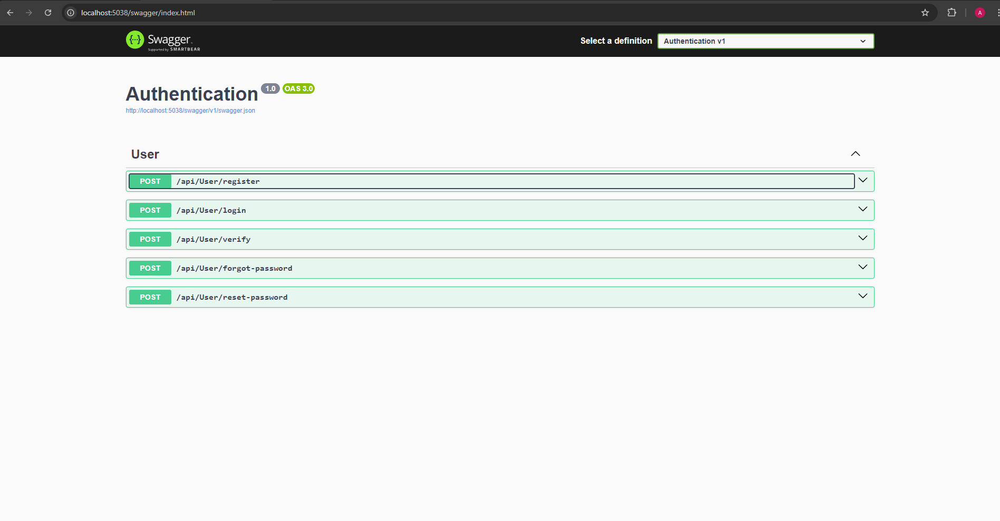
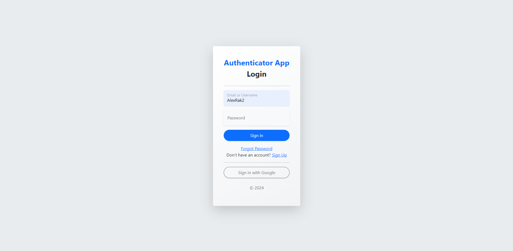
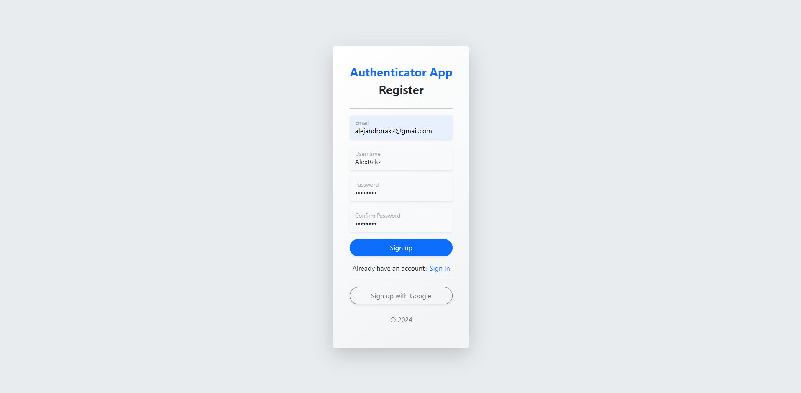
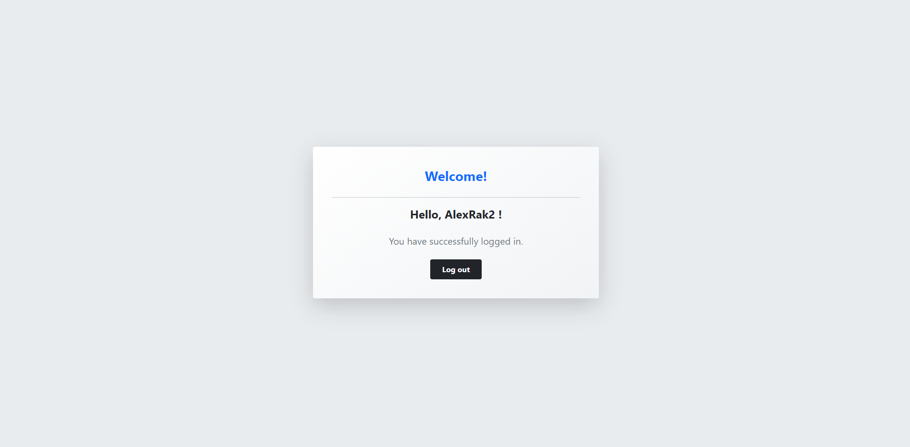
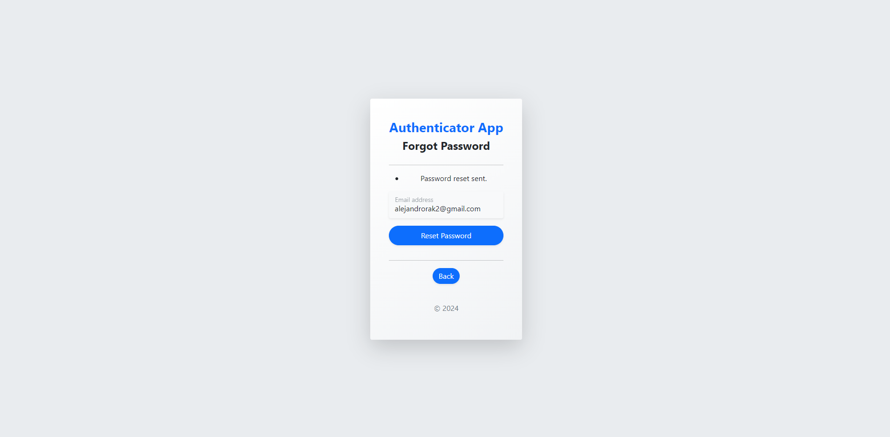
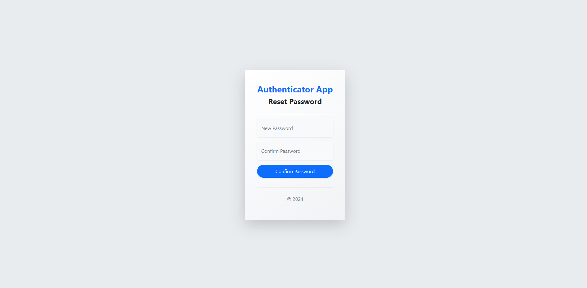
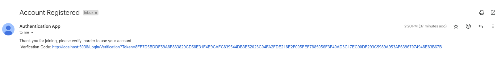
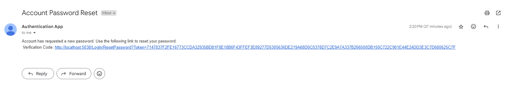
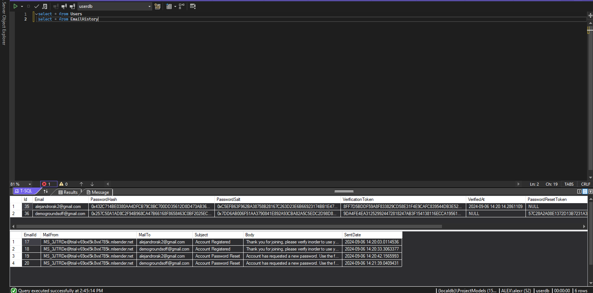

# Custom/Google Authentication API

A login authentication app which manages various login edge cases, including manual and Google-based login, email verification, password resets, and more. All functionality is exposed via API for external integration.

## Features

- **Login**: Supports manual login and Google authentication.
- **Sign Up**: Users can register manually or through Google.
- **Email Verification**: Securely verify user emails upon registration.
- **Forgot Password**: Send password recovery emails.
- **Reset Password**: Allow users to reset their passwords securely.

## Database Structure

- **Users**: Stores all user-related data.
- **EmailHistory**: Tracks and logs all outgoing email activity for auditing.

## Account Types

- **Manual**: Accounts created through manual registration.
- **Google**: Accounts authenticated via Google sign-in.

## Tech Stack

- **ASP.NET MVC**: Provides the backbone for the web app and API functionality.
- **SQL Server**: Serves as the data storage solution.
- **MailerSend**: Used for handling all email services (e.g., verification and password resets).
- **Bootstrap**: Ensures responsive design for all forms and pages.
- **Google OAuth**: Used for secure, streamlined Google authentication.

## Screenshots

## Demo
[Watch the demo on YouTube](https://youtu.be/EXEGD72IHhA)

### API

### Sign In

### Register

### Home

### Forgot/Reset Password

### Email Verifications

### Database

