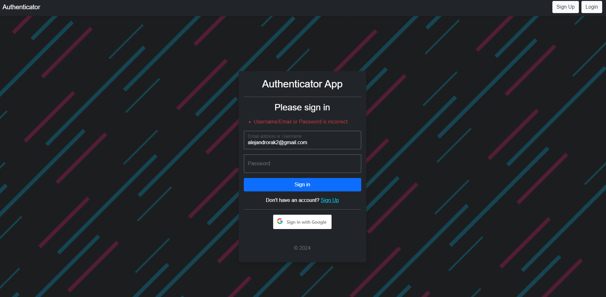
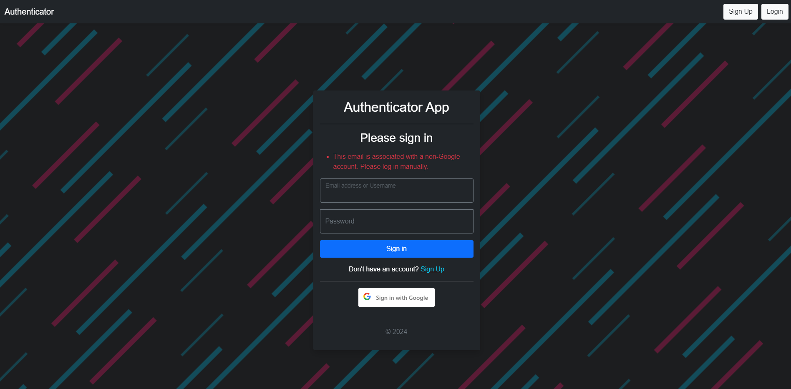
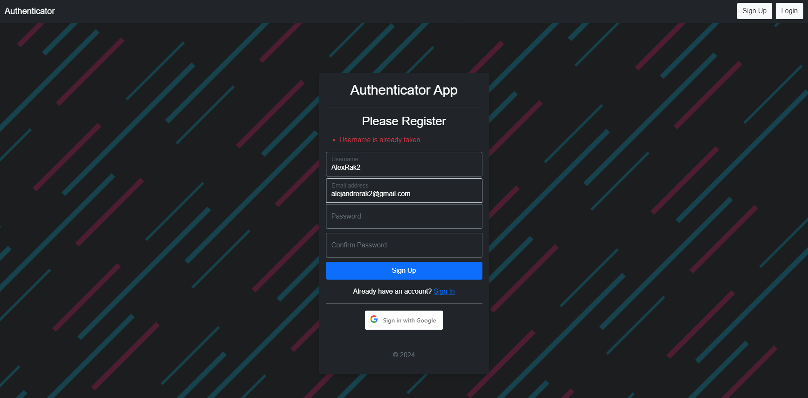
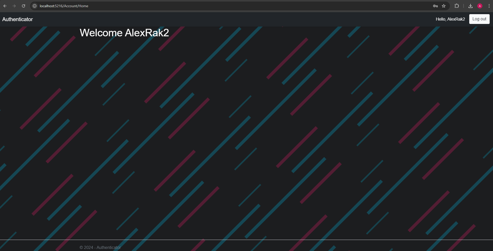

# Custom/Google Authentication

A simple authentication app which shows you how to register/login with custom accounts stored into the database, or uses google authentication to register/login with out a custom account.

## Features

- **Authentication**
  - Log In/Register with a google account
  - Create an account which is stored in the database

## Technology Stack

- **ASP.NET MVC**: For the web application structure.
- **SQL Server**: To store all user data.
- **Bootstrap**: For responsive design and form management.
- **Google Auth**: Authentication provided by google.

## Screenshots

## Demo
[Watch the demo on YouTube](https://youtu.be/kyxZ1fS7NIU)

### Sign In

### Register

### Logged In

